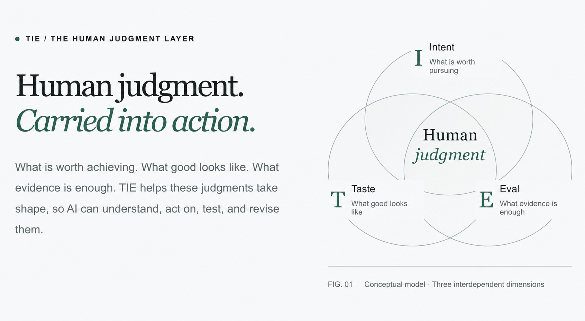

# TIE Studio

**Human judgment. Carried into action.**

TIE Studio is a decision Skill for AI coding agents, built around **Taste, Intent, and Eval**.
It helps you work out what is worth pursuing, what good looks like, and what evidence
would be enough—before committing to substantial execution.

Start with project evidence. Compare real alternatives. Preserve the reasons behind your
choices. Carry those decisions into the next conversation without starting over.

**Codex is the primary, tested implementation.** An independent **Cursor preview** is
also available. Both use the same decision method; each has its own installation,
validation and release path. [MIT licensed](LICENSE).

[Get started with Codex](#get-started-with-codex) · [How it works](#how-it-works) · [Cursor preview](#cursor-preview) · [Contribute](CONTRIBUTING.md)

## How it works



*Intent, Taste and Eval inform one another as human judgment takes shape.
Adapted from the TIE site’s English conceptual model.*

TIE connects three dimensions of a consequential decision:

| Dimension | The question it helps you answer |
| --- | --- |
| **Intent** | What outcome is worth pursuing? |
| **Taste** | Among valid possibilities, what qualities and tradeoffs matter? |
| **Eval** | What evidence would be enough to accept, revise or reject the result? |

You do not need complete answers before starting. TIE Studio reads what already exists,
then uses focused questions, comparisons, near misses or bounded explorations to help
form a working judgment. New evidence can reopen it.

Discussion, accepting a plan and authorizing execution have separate boundaries.
The Skill keeps facts, assumptions, unknowns and user commitments distinct. It does not
turn every suggestion into a requirement or every approved discussion into permission to build.

## Get started with Codex

Give Codex this instruction:

```text
Install TIE Studio for Codex from:
https://github.com/ericqian77/tie-studio-skill

Follow CODEX_INSTALL.md and use the pinned Codex version.
Install into this project's .agents/skills/tie-studio directory.
Check for existing copies first; do not overwrite them or modify other hosts.
```

The Codex package is `tie-studio/`, version **2026.09.06.2**, pinned at
**`review-2026.09.07.2`**. For manual installation, verification, updates and removal,
see [the Codex installation guide](CODEX_INSTALL.md).

Once installed, explicitly invoke `$tie-studio` in your project:

```text
$tie-studio

I want to improve our volunteer onboarding, but I am not sure whether we need
a short guide or a live workshop. Read the project evidence, compare the
alternatives, and help me define what a good result would look like.
Do not implement anything yet.
```

As your understanding changes, correct the direction:

> The goal is comparing conflicting experiences, not faster onboarding.
> Save this correction and pause; do not build.

In a fresh Codex conversation in the same project:

> Use $tie-studio. Resume the existing TIE Session. Summarize the last settled
> decision and the next unresolved question without reopening settled work.

See the [synthetic correction and resume example](EXAMPLE.md) for a worked illustration.

## What stays with your project

The Skill is installed separately from the decisions it helps you make. Your records
remain in plain, inspectable files under your project's `tie/` directory:

| Artifact | Purpose |
| --- | --- |
| `tie/TIE.md` | Durable principles: Intent, Taste, Eval and drift risks |
| `tie/sessions/main/session.md` | Current decisions, evidence, rejected directions, unknowns and resume point |
| Session `blueprint.md` | An on-demand, reviewable synthesis of coherent decisions |
| Session `execution.md` | An explicitly authorized handoff with scope, Eval and stop conditions |

Start with one Session. Add peer Sessions only when the work needs them. A Blueprint is
not automatically an execution approval, and replacing the Skill must not replace your
project decisions.

The package includes guidance for software, writing, research and presentation work,
artifact templates, deterministic validators, and an optional **TIE Workbench**.
Reasoning stays in your coding agent; no additional hosted model service is required.

## Codex validation and scope

The Codex implementation has undergone deterministic regression testing, installed-file
verification, and real-project correction and fresh-task continuation checks. Coverage
includes Session lifecycle, approval boundaries, stale artifacts, Workbench projection
and server behavior, navigation, and reproducible packaging.

Fresh-task continuation has passed a bounded review **with assisted correction**.
That evidence supports the tested workflows; it does not establish perfect autonomous
reconciliation, universal client/model compatibility or long-term judgment quality.
Review consequential decisions and keep uncertainty visible.

The optional Workbench opens only when requested. Validators and Workbench use Python
3.9+; the Workbench server uses POSIX file locking on macOS/Linux. Windows Workbench
parity has not been established.

## Cursor preview

**TIE Studio for Cursor** is an independent preview, distribution version
**2026.09.11-preview.1**. Install `cursor/tie-studio/` into a project's
`.cursor/skills/tie-studio/`; do not install the root Codex package into Cursor.

- [Cursor installation instructions](cursor/START_HERE.md)
- [Compatibility and acceptance status](cursor/ACCEPTANCE.md)
- [Standalone ZIP](downloads/tie-studio-cursor-2026.09.11-preview.1.zip) · [SHA-256](downloads/tie-studio-cursor-2026.09.11-preview.1.zip.sha256)

Package checks have passed. Real Cursor discovery and conversational acceptance remain
incomplete: a previous trial found a global Codex Skill instead of the intended project
Skill. Confirm the actual loaded source before invoking `/tie-studio`. Live Workbench
is disabled in this preview.

## One method, independent host packages

Codex and Cursor derive from a shared method with separate host instructions, version
pins, acceptance and rollback. Updating one installation does not update another.
Cross-host discovery can expose same-name Skills, so directory separation alone is not
proof of runtime isolation. Concurrent writes to the same decision records are unsupported.

Claude Code and other hosts are future integration targets; this repository does not yet
supply validated packages for them.

## Verify, update and contribute

Run `python3 -B verify.py` from a clean repository download to check the
[repository manifest](MANIFEST.json), host-package integrity and Cursor ZIP. Keep the
commit used for installation: `main` can change, while the pinned Codex tag remains available.
Historical snapshot wording describes those snapshots, not the current repository's visibility.

Before an update, back up the installed Skill outside discovery directories. Replace it
with one complete verified package; never merge folders. Uninstall only the selected
host's Skill and preserve your project's `tie/` records.

[Report an issue or contribute](CONTRIBUTING.md) using a small synthetic example and
redacted evidence. This is a derived distribution repository: accepted method and
adapter changes are maintained in the development source and exported as reviewed
packages. Users do not need access to that source to install or contribute feedback.

[MIT license](LICENSE)
